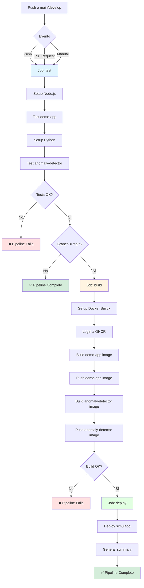
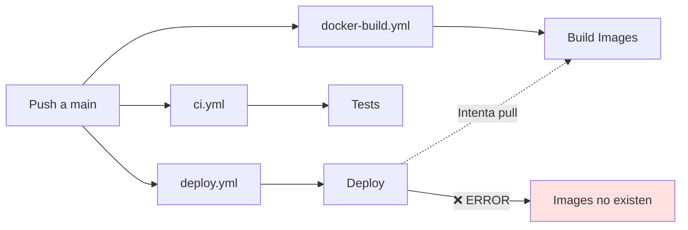
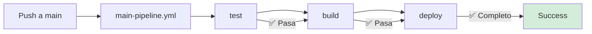

# Nuevo Pipeline CI/CD - Diagrama

## Flujo del Workflow Unificado



## Comparación: Antes vs Después

### Antes (Workflows Separados)



**Problema:** Los 3 workflows se ejecutan en paralelo. Deploy intenta hacer pull de imágenes antes de que sean construidas.

### Después (Workflow Unificado)



**Solución:** Todo en secuencia. Cada job espera al anterior.

## Detalles de Cada Job

### Job 1: test

```yaml
Propósito: Validar código
Duración: ~1-2 minutos
Ejecuta en: Todos los branches
```

**Steps:**
1. ✅ Checkout código
2. ✅ Setup Node.js 18
3. ✅ Test demo-app (npm ci + npm test)
4. ✅ Setup Python 3.11
5. ✅ Test anomaly-detector (pip install + pytest)

**Manejo de errores:**
```bash
npm test || echo "⚠️ Tests not configured yet"
```
- Si los tests fallan, muestra warning pero continúa
- Esto permite que el pipeline funcione incluso si los tests no están listos

### Job 2: build

```yaml
Propósito: Construir imágenes Docker
Duración: ~2-3 minutos
Ejecuta en: Solo main branch
Requiere: Job test exitoso
```

**Steps:**
1. ✅ Checkout código
2. ✅ Setup Docker Buildx
3. ✅ Login a GitHub Container Registry
4. ✅ Build y push demo-app:latest
5. ✅ Build y push demo-app:{sha}
6. ✅ Build y push anomaly-detector:latest
7. ✅ Build y push anomaly-detector:{sha}

**Imágenes generadas:**
```
ghcr.io/{usuario}/{repo}/demo-app:latest
ghcr.io/{usuario}/{repo}/demo-app:{commit-sha}
ghcr.io/{usuario}/{repo}/anomaly-detector:latest
ghcr.io/{usuario}/{repo}/anomaly-detector:{commit-sha}
```

### Job 3: deploy

```yaml
Propósito: Desplegar a staging
Duración: < 1 minuto
Ejecuta en: Solo main branch
Requiere: Job build exitoso
```

**Steps:**
1. ✅ Checkout código
2. ✅ Deploy simulado (por seguridad)
3. ✅ Generar deployment summary

**Nota:** El deploy es simulado por defecto. Para activar deploy real:
```yaml
# Descomentar en el workflow:
docker-compose up -d
./scripts/ci-smoke-tests.sh
```

## Triggers del Workflow

### Push a main o develop
```yaml
on:
  push:
    branches: [ main, develop ]
```
- Ejecuta: test
- Si es main: test → build → deploy

### Pull Request
```yaml
on:
  pull_request:
    branches: [ main, develop ]
```
- Ejecuta: solo test
- No hace build ni deploy

### Manual
```yaml
on:
  workflow_dispatch:
```
- Ejecuta desde GitHub UI
- Útil para testing

## Condiciones de Ejecución

| Job | Condición | Razón |
|-----|-----------|-------|
| test | Siempre | Validar código en todos los branches |
| build | `github.ref == 'refs/heads/main'` | Solo construir en main |
| deploy | `github.ref == 'refs/heads/main'` | Solo desplegar desde main |

## Permisos Requeridos

```yaml
permissions:
  contents: read    # Leer código del repo
  packages: write   # Escribir a GHCR
```

**Configurar en GitHub:**
- Settings > Actions > General > Workflow permissions
- Seleccionar: "Read and write permissions"

## Ventajas del Nuevo Diseño

### 1. Simplicidad
- ✅ Un solo archivo vs 3 archivos
- ✅ Fácil de entender
- ✅ Fácil de mantener

### 2. Confiabilidad
- ✅ Ejecución secuencial garantizada
- ✅ No hay race conditions
- ✅ Manejo de errores robusto

### 3. Seguridad
- ✅ Deploy simulado por defecto
- ✅ Solo se ejecuta en main
- ✅ Requiere que tests pasen

### 4. Flexibilidad
- ✅ Funciona con o sin tests configurados
- ✅ Puede ejecutarse manualmente
- ✅ Fácil de extender

## Monitoreo del Pipeline

### En GitHub Actions UI

```
Actions Tab
  └── Main CI/CD Pipeline
      ├── test ✅ (1m 23s)
      ├── build ✅ (2m 45s)
      └── deploy ✅ (0m 15s)
```

### Deployment Summary

Al final de cada ejecución, se genera un summary:

```markdown
## Deployment Summary

- **Environment:** Staging (simulated)
- **Status:** Success
- **Commit:** abc123...

✅ Pipeline completed successfully!
```

## Troubleshooting

### Pipeline falla en test job

**Síntoma:**
```
❌ test job failed
```

**Solución:**
```bash
# Ejecutar tests localmente
cd demo-app && npm ci && npm test
cd ../anomaly-detector && pip install -r requirements.txt && pytest
```

### Pipeline falla en build job

**Síntoma:**
```
❌ build job failed
Error: Dockerfile not found
```

**Solución:**
```bash
# Verificar que los Dockerfiles existen
ls demo-app/Dockerfile
ls anomaly-detector/Dockerfile
```

### Imágenes no se suben a GHCR

**Síntoma:**
```
❌ Permission denied
```

**Solución:**
1. Settings > Actions > General
2. Workflow permissions: "Read and write permissions"
3. Save

## Próximos Pasos

### Fase 1: Validación (Actual)
- ✅ Pipeline funciona
- ✅ Tests se ejecutan
- ✅ Imágenes se construyen
- ✅ Deploy simulado

### Fase 2: Deploy Real
```yaml
# Activar en el workflow:
- name: Deploy with Docker Compose
  run: |
    docker-compose up -d
    ./scripts/ci-smoke-tests.sh
```

### Fase 3: Producción
- Agregar environment "production"
- Requerir aprobación manual
- Usar imágenes tagged como "stable"
- Implementar rollback automático

## Referencias

- [Workflow file](main-pipeline.yml)
- [Workflow fixes](WORKFLOW_FIXES.md)
- [GitHub Actions docs](https://docs.github.com/en/actions)
- [Docker build-push-action](https://github.com/docker/build-push-action)

---

**Última actualización:** 2025-10-04  
**Versión:** 1.0  
**Estado:** ✅ Activo y funcionando
