# CI/CD Pipeline - Diagrama Visual

## Flujo Completo del Pipeline

```mermaid
graph TB
    Start([Push to main]) --> CI[CI Workflow]
    Start --> Docker[Docker Build Workflow]
    
    subgraph "CI - Build and Test"
        CI --> NodeTest[Node.js Tests]
        CI --> PythonTest[Python Tests]
        NodeTest --> NodeLint[Linters]
        PythonTest --> PythonLint[Flake8/Black/Pylint]
        NodeLint --> Coverage1[Coverage Report]
        PythonLint --> Coverage2[Coverage Report]
        Coverage1 --> CIStatus{All Pass?}
        Coverage2 --> CIStatus
    end
    
    subgraph "Docker Build and Push"
        Docker --> BuildApp[Build demo-app]
        Docker --> BuildDetector[Build anomaly-detector]
        BuildApp --> TagApp[Tag Images]
        BuildDetector --> TagDetector[Tag Images]
        TagApp --> PushApp[Push to GHCR]
        TagDetector --> PushDetector[Push to GHCR]
    end
    
    CIStatus -->|Pass| Deploy[Deploy Workflow]
    CIStatus -->|Fail| FailNotify[❌ Notify Failure]
    PushApp --> Deploy
    PushDetector --> Deploy
    
    subgraph "Deploy to Staging"
        Deploy --> PullImages[Pull Images from GHCR]
        PullImages --> DeployCompose[Deploy with docker-compose]
        DeployCompose --> Wait[Wait 30s]
        Wait --> SmokeTests[Smoke Tests]
        
        subgraph "Smoke Tests"
            SmokeTests --> HealthChecks[Health Checks]
            HealthChecks --> MetricsCheck[Metrics Validation]
            MetricsCheck --> TracesCheck[Traces Validation]
        end
        
        TracesCheck --> TestResult{Tests Pass?}
        TestResult -->|Pass| TagStable[Tag as Stable]
        TestResult -->|Fail| Rollback[🔄 Rollback]
        Rollback --> PullStable[Pull Stable Images]
        PullStable --> RedeployStable[Redeploy Stable]
    end
    
    TagStable --> ManualApproval{Manual Approval}
    
    subgraph "Deploy to Production"
        ManualApproval -->|Approved| ProdDeploy[Deploy to Production]
        ManualApproval -->|Rejected| End1([End])
        ProdDeploy --> ProdSmoke[Production Smoke Tests]
        ProdSmoke --> ProdResult{Tests Pass?}
        ProdResult -->|Pass| Success([✅ Success])
        ProdResult -->|Fail| ProdRollback[🔄 Rollback Production]
        ProdRollback --> End2([End])
    end
    
    style Start fill:#e1f5ff
    style CI fill:#fff4e1
    style Docker fill:#ffe1e1
    style Deploy fill:#f0e1ff
    style Success fill:#e1ffe1
    style FailNotify fill:#ffe1e1
    style Rollback fill:#ffe1e1
    style ProdRollback fill:#ffe1e1
```

---

## Workflows Detallados

### 1. CI Workflow

### 2. Docker Build Workflow

### 3. Deployment Workflow

```mermaid
sequenceDiagram
    participant GH as GitHub
    participant Deploy as Deploy Workflow
    participant GHCR as Container Registry
    participant Compose as Docker Compose
    participant Services as Services
    participant Tests as Smoke Tests
    
    GH->>Deploy: Trigger on main push
    Deploy->>GHCR: Pull latest images
    GHCR->>Deploy: Images downloaded
    
    Deploy->>Compose: docker-compose up -d
    Compose->>Services: Start all services
    Services->>Compose: Services running
    
    Deploy->>Deploy: Wait 30 seconds
    
    Deploy->>Tests: Run smoke tests
    Tests->>Services: Check /health endpoints
    Services->>Tests: 200 OK
    Tests->>Services: Check metrics
    Services->>Tests: Metrics available
    Tests->>Services: Check traces
    Services->>Tests: Traces available
    
    alt Tests Pass
        Tests->>Deploy: ✅ All tests passed
        Deploy->>GHCR: Tag images as stable
        Deploy->>GH: Request manual approval
        GH->>Deploy: Approval received
        Deploy->>Compose: Deploy to production
    else Tests Fail
        Tests->>Deploy: ❌ Tests failed
        Deploy->>GHCR: Pull stable images
        Deploy->>Compose: Rollback to stable
        Deploy->>GH: Notify failure
    end
```

---

## Estados del Pipeline

---

## Matriz de Decisiones

```mermaid
graph LR
    A[Push Event] --> B{Branch?}
    B -->|main| C[Full Pipeline]
    B -->|develop| D[CI + Docker Build]
    B -->|feature/*| E[CI Only]
    
    C --> F{CI Pass?}
    F -->|Yes| G{Docker Build Pass?}
    F -->|No| H[❌ Stop]
    
    G -->|Yes| I[Deploy Staging]
    G -->|No| H
    
    I --> J{Smoke Tests Pass?}
    J -->|Yes| K[Tag Stable]
    J -->|No| L[Rollback]
    
    K --> M{Manual Approval?}
    M -->|Yes| N[Deploy Production]
    M -->|No| O[End]
    
    N --> P{Prod Tests Pass?}
    P -->|Yes| Q[✅ Success]
    P -->|No| R[Rollback Prod]
    
    style C fill:#e1f5ff
    style D fill:#fff4e1
    style E fill:#ffe1e1
    style Q fill:#e1ffe1
    style H fill:#ffe1e1
    style L fill:#ffe1e1
    style R fill:#ffe1e1
```

---

## Timeline del Pipeline

**Tiempo total estimado:**
- CI + Docker Build: ~6 minutos
- Deployment + Smoke Tests: ~4 minutos
- **Total (sin aprobación manual): ~10 minutos**

---

## Componentes del Sistema

---

## Rollback Strategy

---

## Monitoring Points

---

## Referencias

- **Workflows:** [README.md](README.md)
- **Documentación:** [../../CI-CD-IMPLEMENTATION.md](../../CI-CD-IMPLEMENTATION.md)
- **Quick Start:** [../../QUICK-START-CI-CD.md](../../QUICK-START-CI-CD.md)
