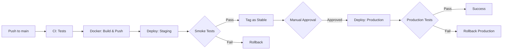

# GitHub Actions CI/CD Workflows

Este directorio contiene los workflows de CI/CD para la plataforma AIOps & SRE Observability.

## Workflows Disponibles

### 1. CI - Build and Test (`ci.yml`)

**Trigger:** Push o Pull Request a `main` o `develop`

**Descripción:** Ejecuta tests y linters para ambos servicios (Node.js y Python)

**Jobs:**
- `test-nodejs`: Prueba la aplicación demo Node.js
  - Instala dependencias con `npm ci`
  - Ejecuta linter (si existe)
  - Ejecuta tests unitarios
  - Genera reporte de cobertura
  
- `test-python`: Prueba el servicio de detección de anomalías
  - Instala dependencias con `pip`
  - Ejecuta flake8, black y pylint
  - Ejecuta tests con pytest
  - Genera reporte de cobertura

- `build-status`: Verifica que todos los tests pasaron

**Uso local:**
```bash
# Para Node.js
cd demo-app
npm ci
npm test

# Para Python
cd anomaly-detector
pip install -r requirements.txt
pytest test_*.py
```

### 2. Docker Build and Push (`docker-build.yml`)

**Trigger:** Push a `main` o `develop`, Pull Request a `main`

**Descripción:** Construye y publica imágenes Docker a GitHub Container Registry

**Jobs:**
- `build-and-push`: Construye imágenes para demo-app y anomaly-detector
  - Usa Docker Buildx para builds optimizados
  - Implementa layer caching para builds más rápidos
  - Etiqueta imágenes con:
    - Nombre de la rama
    - SHA del commit
    - `latest` (solo en rama main)
  - Publica a `ghcr.io`

**Configuración requerida:**
- El workflow usa `GITHUB_TOKEN` automáticamente
- Las imágenes se publican en: `ghcr.io/<owner>/<repo>/<service>:tag`

**Uso local:**
```bash
# Construir imágenes localmente
docker build -t demo-app:local ./demo-app
docker build -t anomaly-detector:local ./anomaly-detector

# O usar docker-compose
docker-compose build
```

### 3. Deploy to Staging (`deploy.yml`)

**Trigger:** 
- Push a `main` (automático a staging)
- Manual dispatch (staging o production)

**Descripción:** Despliega la aplicación y ejecuta smoke tests

**Jobs:**

#### `deploy-staging`
- Descarga imágenes del registry
- Despliega con docker-compose
- Ejecuta smoke tests:
  - Health checks de todos los servicios
  - Validación de métricas en Prometheus
  - Validación de trazas en Tempo
- Rollback automático si fallan los tests
- Etiqueta imágenes como `stable` si el deployment es exitoso

#### `deploy-production`
- Requiere aprobación manual (GitHub Environment)
- Usa imágenes etiquetadas como `stable`
- Ejecuta smoke tests de producción
- Implementa rollback en caso de fallo

**Configuración requerida:**

1. Crear GitHub Environments:
```bash
# En GitHub: Settings > Environments
# Crear: staging, production
# Para production: Agregar "Required reviewers"
```

2. Variables de entorno en docker-compose:
```bash
export DEMO_APP_IMAGE=ghcr.io/<owner>/<repo>/demo-app:latest
export ANOMALY_DETECTOR_IMAGE=ghcr.io/<owner>/<repo>/anomaly-detector:latest
docker-compose up -d
```

**Smoke Tests incluidos:**
- ✅ Health checks de demo-app (`/health`, `/ready`)
- ✅ Health check de Prometheus
- ✅ Health check de Grafana
- ✅ Validación de métricas en Prometheus
- ✅ Validación de trazas en Tempo

**Uso local para testing:**
```bash
# Simular deployment local
export DEMO_APP_IMAGE=demo-app:local
export ANOMALY_DETECTOR_IMAGE=anomaly-detector:local
docker-compose up -d

# Ejecutar smoke tests manualmente
curl -f http://localhost:3000/health
curl -f http://localhost:3000/ready
curl -f http://localhost:9090/-/healthy
curl -f http://localhost:3001/api/health

# Verificar métricas
curl -s http://localhost:9090/api/v1/query?query=up

# Generar tráfico para trazas
curl http://localhost:3000/api/users
curl http://localhost:3000/api/products
```

## Flujo Completo de CI/CD



## Troubleshooting

### Error: "npm ci" falla
**Solución:** Asegúrate de que `package-lock.json` existe y está actualizado
```bash
cd demo-app
npm install
git add package-lock.json
git commit -m "Update package-lock.json"
```

### Error: Docker build falla
**Solución:** Verifica que los Dockerfiles son válidos
```bash
docker build -t test ./demo-app
docker build -t test ./anomaly-detector
```

### Error: Smoke tests fallan
**Solución:** Verifica que todos los servicios están corriendo
```bash
docker-compose ps
docker-compose logs demo-app
docker-compose logs prometheus
```

### Error: No se puede pushear a GHCR
**Solución:** Verifica permisos del token
- El workflow usa `GITHUB_TOKEN` automáticamente
- Asegúrate de que el repositorio tiene permisos de packages habilitados
- Settings > Actions > General > Workflow permissions: "Read and write permissions"

## Mejoras Futuras

- [ ] Agregar tests de integración end-to-end
- [ ] Implementar deployment a Kubernetes
- [ ] Agregar análisis de seguridad (Snyk, Trivy)
- [ ] Implementar blue-green deployment
- [ ] Agregar notificaciones a Slack/Discord
- [ ] Implementar canary deployments
- [ ] Agregar performance testing

## Referencias

- [GitHub Actions Documentation](https://docs.github.com/en/actions)
- [Docker Build Push Action](https://github.com/docker/build-push-action)
- [GitHub Container Registry](https://docs.github.com/en/packages/working-with-a-github-packages-registry/working-with-the-container-registry)
