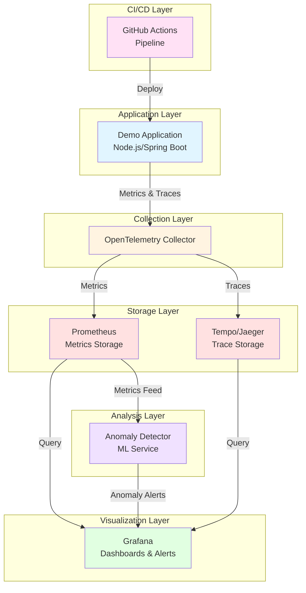

# Design Document - AIOps & SRE Observability Platform

## Overview

Esta plataforma implementa un sistema completo de observabilidad y AIOps que combina instrumentación moderna con OpenTelemetry, monitoreo basado en SLIs/SLOs, y detección inteligente de anomalías. El sistema está diseñado para proporcionar visibilidad end-to-end de aplicaciones distribuidas, permitiendo a los equipos SRE detectar, diagnosticar y resolver incidentes de manera proactiva.

La arquitectura sigue principios de observabilidad moderna utilizando los tres pilares fundamentales: métricas, trazas y logs. El sistema integra detección de anomalías basada en machine learning para reducir el MTTR (Mean Time To Recovery) y proporciona un enfoque SLO-driven para la gestión de la confiabilidad del servicio.

**Decisión de diseño:** Se eligió OpenTelemetry como estándar de instrumentación por ser vendor-neutral, ampliamente adoptado, y proporcionar SDKs maduros para múltiples lenguajes. Esto garantiza portabilidad y evita lock-in con proveedores específicos.

## Architecture

### High-Level Architecture



**Decisión de diseño:** La arquitectura utiliza un patrón de recopilación centralizada con el OpenTelemetry Collector como punto de agregación. Esto permite desacoplar la aplicación de los backends de almacenamiento, facilita el procesamiento y enriquecimiento de telemetría, y proporciona un punto único para implementar retry logic y buffering.

### Deployment Architecture

El sistema soporta dos modos de despliegue:

1. **Local Development (Docker Compose):** Todos los componentes se ejecutan como contenedores Docker orquestados por Docker Compose. Ideal para desarrollo, testing y demos.

2. **Production (Kubernetes):** Despliegue en Kubernetes usando Helm charts o Kustomize, con soporte para alta disponibilidad, escalado horizontal y persistencia de datos.

**Decisión de diseño:** Soportar ambos modos de despliegue permite a los desarrolladores trabajar localmente con el stack completo mientras se mantiene paridad con producción. Docker Compose simplifica el onboarding, mientras que Kubernetes proporciona las capacidades de orquestación necesarias para producción.

## Components and Interfaces

### 1. Demo Application

**Responsabilidad:** Aplicación de ejemplo instrumentada con OpenTelemetry que genera telemetría realista.

**Tecnología:** Node.js (Express)

**Interfaces:**
- HTTP API endpoints para simular tráfico
- OpenTelemetry SDK integrado para exportar métricas y trazas
- Health check endpoints (`/health`, `/ready`)

**Métricas exportadas:**
- Métricas automáticas: CPU, memoria, garbage collection
- Métricas HTTP: request count, duration, status codes
- Métricas custom: business metrics específicas de la aplicación

**Trazas generadas:**
- Spans HTTP con información de request/response
- Spans de base de datos (si aplica)
- Spans custom para operaciones de negocio
- Propagación de contexto entre servicios (si es multi-servicio)

**Decisión de diseño:** Se instrumenta automáticamente usando auto-instrumentation de OpenTelemetry cuando sea posible, complementado con instrumentación manual para métricas y spans de negocio. Esto minimiza el código boilerplate y facilita el mantenimiento.

### 2. OpenTelemetry Collector

**Responsabilidad:** Recibir, procesar y exportar telemetría a múltiples backends.

**Configuración:**
```yaml
receivers:
  otlp:
    protocols:
      grpc:
        endpoint: 0.0.0.0:4317
      http:
        endpoint: 0.0.0.0:4318

processors:
  batch:
    timeout: 10s
    send_batch_size: 1024
  memory_limiter:
    check_interval: 1s
    limit_mib: 512

exporters:
  prometheus:
    endpoint: 0.0.0.0:8889
  otlp/tempo:
    endpoint: tempo:4317
    tls:
      insecure: true

service:
  pipelines:
    metrics:
      receivers: [otlp]
      processors: [memory_limiter, batch]
      exporters: [prometheus]
    traces:
      receivers: [otlp]
      processors: [memory_limiter, batch]
      exporters: [otlp/tempo]
```

**Decisión de diseño:** El Collector incluye procesadores de batch y memory_limiter para optimizar el rendimiento y prevenir OOM. El batching reduce la carga en los backends, mientras que memory_limiter protege contra picos de telemetría.

### 3. Prometheus

**Responsabilidad:** Almacenar y consultar métricas de series temporales.

**Configuración:**
- Retention: 15 días mínimo
- Scrape interval: 15 segundos
- Storage: Volumen persistente para datos históricos

**Scrape targets:**
- OpenTelemetry Collector (métricas de la aplicación)
- Prometheus self-monitoring
- Kubernetes metrics (en despliegue K8s)

**Decisión de diseño:** Prometheus se elige por su madurez, eficiencia en almacenamiento de series temporales, y excelente integración con Grafana. El modelo pull-based simplifica el descubrimiento de servicios en Kubernetes.

### 4. Tempo/Jaeger

**Responsabilidad:** Almacenar y consultar trazas distribuidas.

**Opción A - Tempo:**
- Backend de trazas de Grafana Labs
- Almacenamiento eficiente en object storage
- Integración nativa con Grafana

**Opción B - Jaeger:**
- Sistema de tracing distribuido de CNCF
- UI standalone para exploración de trazas
- Múltiples opciones de backend storage

**Decisión de diseño:** Se recomienda Tempo para nuevos despliegues por su eficiencia de almacenamiento y mejor integración con Grafana. Jaeger se mantiene como opción para equipos que ya lo utilizan o prefieren su UI standalone.

### 5. Grafana

**Responsabilidad:** Visualización de métricas, trazas, dashboards y gestión de alertas.

**Datasources configurados:**
- Prometheus (métricas)
- Tempo/Jaeger (trazas)

**Dashboards preconfigurados:**

1. **SLI/SLO Dashboard:**
   - Latencia P95 y P99 por endpoint
   - Error rate (4xx, 5xx)
   - Request rate (throughput)
   - Error budget restante y burn rate
   - Proyección de agotamiento de error budget

2. **Application Performance Dashboard:**
   - Request duration histograms
   - Throughput por endpoint
   - Error rate breakdown
   - Resource utilization (CPU, memoria)

3. **Distributed Tracing Dashboard:**
   - Trace search y filtrado
   - Service dependency graph
   - Latency breakdown por servicio
   - Error traces destacados

**Alertas configuradas:**
- High burn rate (error budget consumption)
- Latency P95 > SLI threshold
- Error rate > 1%
- Anomalías detectadas por ML

**Decisión de diseño:** Los dashboards se provisionan automáticamente usando Grafana provisioning para garantizar consistencia entre entornos. Las alertas siguen el enfoque multi-window multi-burn-rate recomendado por Google SRE para balancear sensibilidad y precisión.

### 6. Anomaly Detector Service

**Responsabilidad:** Detectar anomalías en métricas usando algoritmos de machine learning.

**Tecnología:** Python con bibliotecas de ML (scikit-learn, Prophet, o statsmodels)

**Algoritmo:** Holt-Winters Exponential Smoothing o Prophet para series temporales

**Flujo de trabajo:**
1. Query Prometheus cada N minutos para obtener métricas clave
2. Entrenar modelo con ventana histórica (7-30 días)
3. Predecir valores esperados para el período actual
4. Calcular desviación entre valor real y predicción
5. Si desviación > umbral, generar alerta de anomalía
6. Enviar alerta a Grafana/Alertmanager con contexto

**Métricas monitoreadas:**
- Request latency (P50, P95, P99)
- Request rate
- Error rate
- Resource utilization

**Output:**
```json
{
  "timestamp": "2025-10-03T10:30:00Z",
  "metric": "http_request_duration_p95",
  "expected_value": 150,
  "actual_value": 450,
  "deviation": 200,
  "confidence": 0.95,
  "severity": "high",
  "context": {
    "service": "demo-app",
    "endpoint": "/api/users"
  }
}
```

**Decisión de diseño:** Se utiliza Holt-Winters por su capacidad de capturar tendencias y estacionalidad en series temporales sin requerir grandes volúmenes de datos de entrenamiento. El servicio es stateless y puede escalar horizontalmente si es necesario.

### 7. CI/CD Pipeline (GitHub Actions)

**Responsabilidad:** Automatizar build, test y deployment de la aplicación.

**Stages:**

1. **Build & Test:**
   - Checkout código
   - Instalar dependencias
   - Ejecutar linters
   - Ejecutar unit tests
   - Generar coverage report

2. **Docker Build:**
   - Build imagen Docker
   - Tag con commit SHA y latest
   - Push a container registry (Docker Hub, GHCR, ECR)

3. **Deploy:**
   - Deploy a entorno de staging (Docker Compose o K8s)
   - Ejecutar smoke tests
   - Si exitoso, promover a producción (manual approval)

4. **Verify:**
   - Validar health checks
   - Verificar métricas baseline
   - Rollback automático si falla

**Decisión de diseño:** El pipeline implementa continuous deployment a staging con promoción manual a producción. Esto balancea velocidad de entrega con control de riesgo. Los smoke tests post-deployment validan funcionalidad básica antes de considerar el deployment exitoso.

## Data Models

### Metrics Data Model

Las métricas siguen el modelo de OpenTelemetry/Prometheus:

```
metric_name{label1="value1", label2="value2"} value timestamp
```

**Métricas clave:**

```
# Request metrics
http_server_request_duration_seconds{service="demo-app", endpoint="/api/users", method="GET", status="200"}
http_server_requests_total{service="demo-app", endpoint="/api/users", method="GET", status="200"}

# Error metrics
http_server_errors_total{service="demo-app", endpoint="/api/users", method="GET", status="500"}

# Resource metrics
process_cpu_usage{service="demo-app"}
process_memory_usage_bytes{service="demo-app"}
```

### Trace Data Model

Las trazas siguen el modelo de OpenTelemetry:

```json
{
  "traceId": "abc123...",
  "spanId": "def456...",
  "parentSpanId": "ghi789...",
  "name": "GET /api/users",
  "kind": "SERVER",
  "startTime": "2025-10-03T10:30:00.000Z",
  "endTime": "2025-10-03T10:30:00.150Z",
  "attributes": {
    "http.method": "GET",
    "http.url": "/api/users",
    "http.status_code": 200,
    "service.name": "demo-app"
  },
  "events": [],
  "status": {
    "code": "OK"
  }
}
```

### SLI/SLO Data Model

```yaml
slos:
  - name: "API Latency"
    sli:
      metric: "http_server_request_duration_seconds"
      percentile: 95
      threshold: 200ms
    target: 99.9%  # 99.9% of requests < 200ms
    window: 30d
    
  - name: "API Availability"
    sli:
      metric: "http_server_requests_total"
      error_query: "status >= 500"
    target: 99.95%  # 99.95% success rate
    window: 30d
```

**Error Budget Calculation:**
```
error_budget = (1 - target) * total_requests
error_budget_remaining = error_budget - errors_observed
burn_rate = (errors_in_window / window_duration) / (error_budget / slo_window)
```

## Error Handling

### Application Level

**Estrategia:** Capturar errores y registrarlos en trazas con contexto completo.

```javascript
// Node.js example
app.use((err, req, res, next) => {
  const span = trace.getActiveSpan();
  if (span) {
    span.recordException(err);
    span.setStatus({ code: SpanStatusCode.ERROR, message: err.message });
  }
  res.status(500).json({ error: err.message });
});
```

### Collector Level

**Estrategia:** Implementar retry logic con backoff exponencial y buffering.

- Si el backend está down, el Collector buferea datos en memoria (hasta memory_limiter)
- Retry con backoff exponencial: 1s, 2s, 4s, 8s, 16s, 32s
- Si el buffer se llena, drop oldest data (con logging)

### Storage Level

**Estrategia:** Monitorear salud de Prometheus y Tempo, alertar si hay problemas de escritura.

- Health checks periódicos
- Alertas si write latency > threshold
- Alertas si disk usage > 80%

### Anomaly Detector Level

**Estrategia:** Graceful degradation si no hay suficientes datos históricos.

- Si < 7 días de datos, usar umbrales estáticos
- Si query a Prometheus falla, retry con backoff
- Log errores pero no bloquear el sistema

**Decisión de diseño:** El sistema prioriza disponibilidad sobre consistencia perfecta. Es preferible perder algunos datos de telemetría que bloquear la aplicación o el pipeline de observabilidad.

## Testing Strategy

### Unit Tests

**Scope:** Componentes individuales aislados.

**Aplicación:**
- Lógica de negocio
- Utilidades y helpers
- Validación de datos

**Anomaly Detector:**
- Algoritmos de detección
- Cálculo de desviaciones
- Generación de alertas

**Coverage target:** 80%

### Integration Tests

**Scope:** Interacción entre componentes.

**Tests:**
- Aplicación → OpenTelemetry Collector (métricas y trazas se exportan correctamente)
- Collector → Prometheus (métricas se almacenan)
- Collector → Tempo (trazas se almacenan)
- Anomaly Detector → Prometheus (queries funcionan)
- Grafana → Datasources (conexión y queries)

### End-to-End Tests

**Scope:** Flujos completos del sistema.

**Scenarios:**
1. **Happy Path:** Request → Tracing → Metrics → Dashboard
2. **Error Path:** Error en app → Error trace → Alert generada
3. **Anomaly Detection:** Spike de latencia → Anomalía detectada → Alert generada
4. **SLO Breach:** Error budget agotado → Alert crítica generada

### Smoke Tests (CI/CD)

**Scope:** Validación post-deployment.

**Tests:**
- Health checks de todos los servicios
- Métricas baseline están siendo reportadas
- Dashboards de Grafana son accesibles
- Al menos una traza visible en Tempo

**Decisión de diseño:** Los tests se ejecutan en orden de velocidad (unit → integration → e2e) para fail fast. Los smoke tests en CI/CD son mínimos pero críticos para validar que el deployment fue exitoso.

## Deployment Considerations

### Docker Compose Deployment

**Archivo:** `docker-compose.yml`

**Servicios:**
- demo-app
- otel-collector
- prometheus
- tempo (o jaeger)
- grafana
- anomaly-detector

**Volúmenes persistentes:**
- prometheus-data
- tempo-data
- grafana-data

**Networks:**
- observability-network (bridge)

**Provisioning:**
- Grafana datasources: `/etc/grafana/provisioning/datasources/`
- Grafana dashboards: `/etc/grafana/provisioning/dashboards/`
- Prometheus config: `/etc/prometheus/prometheus.yml`
- OTel Collector config: `/etc/otel-collector/config.yaml`

### Kubernetes Deployment

**Opción A - Helm:**

```
helm install aiops-platform ./helm-chart \
  --namespace observability \
  --create-namespace \
  --values values-prod.yaml
```

**Opción B - Kustomize:**

```
kustomize build overlays/production | kubectl apply -f -
```

**Resources:**
- Deployments: demo-app, otel-collector, anomaly-detector
- StatefulSets: prometheus, tempo
- Services: ClusterIP para comunicación interna, LoadBalancer para Grafana
- ConfigMaps: Configuraciones de cada componente
- PersistentVolumeClaims: Almacenamiento para Prometheus y Tempo
- ServiceMonitors: Para Prometheus Operator (si se usa)

**Resource Requests/Limits:**
```yaml
demo-app:
  requests: { cpu: 100m, memory: 128Mi }
  limits: { cpu: 500m, memory: 512Mi }

prometheus:
  requests: { cpu: 500m, memory: 2Gi }
  limits: { cpu: 2000m, memory: 4Gi }

tempo:
  requests: { cpu: 500m, memory: 1Gi }
  limits: { cpu: 1000m, memory: 2Gi }
```

**Decisión de diseño:** Los resource limits previenen que un componente consuma todos los recursos del cluster. Los requests garantizan QoS mínimo. Los valores son punto de partida y deben ajustarse según carga real.

### Scaling Considerations

**Horizontal Scaling:**
- Demo app: Puede escalar horizontalmente sin límite
- OTel Collector: Puede escalar horizontalmente, usar load balancer
- Anomaly Detector: Stateless, puede escalar horizontalmente

**Vertical Scaling:**
- Prometheus: Requiere más memoria con más series temporales
- Tempo: Requiere más storage con más trazas

**Decisión de diseño:** La arquitectura está diseñada para escalar horizontalmente en la capa de aplicación y recopilación, mientras que el almacenamiento escala verticalmente o mediante sharding (Prometheus federation, Tempo multi-tenant).

## Monitoring the Monitoring System

**Meta-observability:** El sistema de observabilidad debe monitorearse a sí mismo.

**Métricas clave:**
- OTel Collector: dropped spans/metrics, export latency
- Prometheus: ingestion rate, storage usage, query latency
- Tempo: ingestion rate, storage usage
- Grafana: dashboard load time, query errors

**Alertas:**
- Collector dropping data
- Prometheus storage > 80%
- Tempo storage > 80%
- Cualquier componente down

**Decisión de diseño:** Si el sistema de observabilidad falla, debe ser evidente inmediatamente. Las alertas críticas deben enviarse a un canal externo (PagerDuty, Slack) para garantizar visibilidad.

## Security Considerations

**Autenticación:**
- Grafana: Autenticación básica o OAuth/SAML
- Prometheus: Sin autenticación por defecto (proteger con network policies)
- Tempo: Sin autenticación por defecto (proteger con network policies)

**Autorización:**
- Grafana: RBAC para controlar acceso a dashboards y datasources
- Kubernetes: RBAC para limitar acceso a recursos

**Network Security:**
- Kubernetes: NetworkPolicies para limitar comunicación entre pods
- Docker Compose: Network isolation entre servicios

**Secrets Management:**
- Kubernetes: Usar Secrets para credenciales
- Docker Compose: Usar environment variables o Docker secrets

**Decisión de diseño:** En entornos de producción, todos los endpoints deben estar protegidos con autenticación. En desarrollo local, se puede simplificar para facilitar el uso.

## Performance Optimization

**Collector:**
- Batching para reducir overhead de red
- Memory limiter para prevenir OOM
- Sampling de trazas si el volumen es muy alto (tail-based sampling)

**Prometheus:**
- Recording rules para pre-calcular queries complejas
- Retention adecuado para balancear storage y utilidad
- Federation para escalar horizontalmente

**Grafana:**
- Query caching
- Dashboard query optimization (evitar queries muy amplias)
- Usar variables de dashboard para filtrado eficiente

**Decisión de diseño:** La optimización se enfoca en reducir latencia de queries y uso de recursos sin sacrificar funcionalidad. El sampling de trazas solo se implementa si el volumen es prohibitivo (>10k spans/sec).

## Future Enhancements

**Posibles mejoras futuras:**

1. **Logs Integration:** Agregar Loki para el tercer pilar de observabilidad
2. **Service Mesh:** Integrar con Istio/Linkerd para observabilidad automática
3. **AIOps Avanzado:** Root cause analysis automático, incident prediction
4. **Cost Optimization:** Análisis de costo de observabilidad, recomendaciones de sampling
5. **Multi-tenancy:** Soporte para múltiples equipos/aplicaciones en la misma plataforma
6. **Chaos Engineering:** Integración con herramientas de chaos para validar observabilidad

Estas mejoras no son parte del MVP pero representan evolución natural del sistema.
