# Resumen Ejecutivo - Ejecución de la Implementación

## 🚀 Inicio Rápido (3 Pasos)

### Paso 1: Levantar Servicios
```bash
.\start-platform.bat
```
**Tiempo:** 2-3 minutos  
**Resultado:** 6 servicios corriendo

### Paso 2: Ejecutar Smoke Tests
```bash
.\scripts\smoke-tests.ps1
```
**Tiempo:** 1-2 minutos  
**Resultado:** Validación completa ✅

### Paso 3: Acceder a Grafana
```
URL: http://localhost:3001
User: admin
Pass: admin
```
**Resultado:** Ver dashboards con datos

---

## 📋 Comandos Esenciales

### Iniciar
```bash
docker-compose up -d
```

### Verificar Estado
```bash
docker-compose ps
```

### Ver Logs
```bash
docker-compose logs -f
```

### Generar Tráfico
```bash
.\generate-traffic.bat
```

### Ejecutar Tests
```bash
.\scripts\smoke-tests.ps1
```

### Detener
```bash
docker-compose down
```

---

## 🌐 URLs de Acceso

| Servicio | URL | Credenciales |
|----------|-----|--------------|
| **Grafana** | http://localhost:3001 | admin/admin |
| **Prometheus** | http://localhost:9090 | - |
| **Tempo** | http://localhost:3200 | - |
| **Demo App** | http://localhost:3000 | - |

---

## ✅ Validación Rápida

```bash
# 1. Servicios corriendo
docker-compose ps
# Esperado: 6 servicios "Up"

# 2. Health checks
curl http://localhost:3000/health
curl http://localhost:9090/-/healthy
curl http://localhost:3001/api/health

# 3. Smoke tests
.\scripts\smoke-tests.ps1
# Esperado: Todos los tests pasan ✅
```

---

## 🎯 Flujo Completo de Validación

```mermaid
graph LR
    A[Iniciar] --> B[docker-compose up -d]
    B --> C[Esperar 60s]
    C --> D[Smoke Tests]
    D --> E{Tests OK?}
    E -->|Sí| F[Abrir Grafana]
    E -->|No| G[Ver Logs]
    F --> H[Generar Tráfico]
    H --> I[Ver Dashboards]
    I --> J[✅ Validado]
    G --> B
```



---

## 📊 Checklist de Validación

- [ ] Docker y Docker Compose instalados
- [ ] Servicios levantados (`docker-compose up -d`)
- [ ] 6 contenedores corriendo (`docker-compose ps`)
- [ ] Smoke tests pasan (`.\scripts\smoke-tests.ps1`)
- [ ] Grafana accesible (http://localhost:3001)
- [ ] Dashboards muestran datos
- [ ] Prometheus tiene métricas
- [ ] Tempo tiene trazas

---

## 🐛 Troubleshooting Rápido

### Problema: Servicios no inician
```bash
docker-compose down
docker-compose up -d --build
```

### Problema: No hay datos en dashboards
```bash
.\generate-traffic.bat
# Esperar 30 segundos
# Refrescar Grafana
```

### Problema: Tests fallan
```bash
docker-compose logs
docker-compose restart
.\scripts\smoke-tests.ps1
```

---

## 📚 Documentación Completa

- **Quick Start:** [QUICK_START.md](QUICK_START.md)
- **Validation Guide:** [VALIDATION_GUIDE.md](VALIDATION_GUIDE.md)
- **Smoke Tests:** [scripts/SMOKE_TESTS_README.md](scripts/SMOKE_TESTS_README.md)
- **CI/CD:** [CI-CD-IMPLEMENTATION.md](CI-CD-IMPLEMENTATION.md)
- **Kubernetes:** [k8s/README.md](k8s/README.md)

---

## 🎉 Resultado Esperado

Después de seguir estos pasos, deberías tener:

✅ **6 servicios corriendo:**
- demo-app
- otel-collector
- prometheus
- tempo
- grafana
- anomaly-detector

✅ **Dashboards funcionando:**
- SLI/SLO Dashboard
- Application Performance
- Distributed Tracing

✅ **Telemetry pipeline operativa:**
- Métricas en Prometheus
- Trazas en Tempo
- Visualización en Grafana

✅ **CI/CD configurado:**
- Pipeline en GitHub Actions
- Smoke tests automatizados
- Docker images publicadas

✅ **Kubernetes ready:**
- Manifiestos Kustomize
- Helm chart
- Overlays dev/prod

---

## 🚀 Próximos Pasos

1. **Explorar Grafana**
   - Ver dashboards
   - Configurar alertas
   - Crear queries personalizadas

2. **Probar Anomaly Detection**
   - Generar spike de latencia
   - Ver detección automática
   - Revisar alertas

3. **CI/CD**
   - Hacer cambio en código
   - Push a GitHub
   - Ver pipeline ejecutarse

4. **Kubernetes** (Opcional)
   - Desplegar con Kustomize
   - O usar Helm chart
   - Validar en cluster

---

**Tiempo total de ejecución:** 5-10 minutos  
**Complejidad:** Baja  
**Resultado:** Sistema completamente funcional ✅

---

**¿Listo para empezar?**

```bash
.\start-platform.bat
```

🎊 **¡Disfruta tu plataforma de observabilidad!** 🎊
