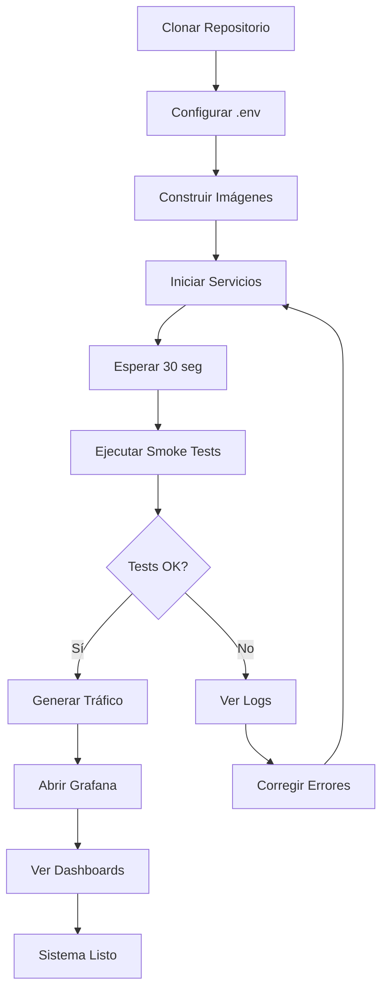

# 📊 Resumen Ejecutivo - Metodología y Procedimiento

> **Documentación completa de cómo ejecutar y validar el proyecto**

---

## ✅ Archivos Creados

| Archivo | Propósito | Ubicación |
|---------|-----------|-----------|
| **METODOLOGIA_PROCEDIMIENTO.md** | Guía completa paso a paso | Raíz del proyecto |
| **Makefile** | Automatización de comandos | Raíz del proyecto |
| **.env.example** | Plantilla de variables de entorno | Raíz del proyecto |
| **QUICK_START_GUIDE.md** | Guía de inicio rápido | Raíz del proyecto |

---

## 📖 Contenido Documentado

### 1. Pasos Reproducibles con Comandos

#### ✅ Comandos Bash/Shell

```bash
# Setup inicial
git clone https://github.com/Sklaid/Proyecto-g5.git
cd Proyecto-g5
cp .env.example .env

# Construir y ejecutar
docker-compose build
docker-compose up -d

# Validar
./scripts/smoke-tests.ps1

# Generar tráfico
curl http://localhost:3000/api/users
curl http://localhost:3000/api/products
```

#### ✅ Comandos con Makefile

```bash
# Ver ayuda
make help

# Setup completo
make quick-start

# Comandos individuales
make build          # Construir imágenes
make up             # Iniciar servicios
make status         # Ver estado detallado
make smoke-test     # Ejecutar tests
make traffic        # Generar tráfico
make traffic-errors # Generar solo errores (20 errores)
make traffic-mixed  # Generar trafico mixto 15% errores (120s)
make logs           # Ver logs
make down           # Detener servicios
make clean          # Limpiar todo

#Adicionales
make quick-start    # Setup completo
make ps             # Ver estado
make down           # Apagar servicios
```

### 2. Datos de Prueba / Fixtures / Variables

#### ✅ Archivo .env.example

Contiene todas las variables de entorno necesarias:

```bash
# Imágenes Docker
DEMO_APP_IMAGE=demo-app:local
ANOMALY_DETECTOR_IMAGE=anomaly-detector:local

# Grafana
GF_SECURITY_ADMIN_USER=admin
GF_SECURITY_ADMIN_PASSWORD=grupo5_devops

# Prometheus
PROMETHEUS_RETENTION_TIME=15d

# Anomaly Detector
PROMETHEUS_URL=http://prometheus:9090
CHECK_INTERVAL_MINUTES=5
HISTORICAL_DAYS=7
ANOMALY_THRESHOLD=2.5
LOG_LEVEL=INFO
```

#### ✅ Fixtures de Datos

**Endpoints con datos predefinidos:**

```javascript
//CONSULTAR USUARIOS GET /api/users
//curl http://localhost:3000/api/users

[
  { "id": 1, "name": "Alice", "email": "alice@example.com" },
  { "id": 2, "name": "Bob", "email": "bob@example.com" },
  { "id": 3, "name": "Charlie", "email": "charlie@example.com" }
]

//CONSULTAR PRODUCTOS GET /api/products
//curl http://localhost:3000/api/products

[
  { "id": 1, "name": "Laptop", "price": 999.99 },
  { "id": 2, "name": "Mouse", "price": 29.99 },
  { "id": 3, "name": "Keyboard", "price": 79.99 }
]

// GET /api/orders
[
  { "id": 1, "userId": 1, "productId": 1, "quantity": 1 },
  { "id": 2, "userId": 2, "productId": 2, "quantity": 2 }
]
```

**Scripts de generación de tráfico:**

```powershell
# Tráfico continuo
.\scripts\traffic-generation\generate-continuous-traffic.ps1 `
    -DurationSeconds 60 `
    -RequestsPerSecond 5

# Tráfico mixto (normal + errores)
.\scripts\traffic-generation\generate-mixed-traffic.ps1 `
    -DurationSeconds 120 `
    -ErrorRatePercent 15

# Solo errores
.\scripts\traffic-generation\generate-test-errors.ps1 `
    -ErrorCount 20 `
    -DelaySeconds 1
```

### 3. Cómo Correr en Local

#### ✅ Método 1: Makefile (Recomendado)

```bash
# Setup completo en un comando
make quick-start
#Ejecutar tráfico
make traffic
# O paso a paso
make build
make up
make smoke-test
make traffic
```

#### ✅ Método 2: Docker Compose

```bash
# Paso 1: Construir imágenes
docker-compose build

# Paso 2: Iniciar servicios
docker-compose up -d

# Paso 3: Verificar estado
docker-compose ps

# Paso 4: Validar
./scripts/smoke-tests.sh

# Paso 5: Generar tráfico
curl http://localhost:3000/api/users
```

#### ✅ Método 3: Scripts PowerShell (Windows)

```powershell
# Iniciar servicios
docker-compose up -d

# Ejecutar smoke tests
.\scripts\smoke-tests.ps1

# Generar tráfico
.\scripts\traffic-generation\generate-continuous-traffic.ps1 -DurationSeconds 60

# Abrir dashboards
.\scripts\utilities\open-all-dashboards.bat
```

---

## 🎯 Flujo de Trabajo Completo

### Diagrama de Flujo



### Comandos Secuenciales

```bash
# 1. Setup inicial (solo primera vez)
git clone https://github.com/Sklaid/Proyecto-g5.git
cd Proyecto-g5
cp .env.example .env

# 2. Construir imágenes
make build
# O: docker-compose build

# 3. Iniciar servicios
make up
# O: docker-compose up -d

# 4. Esperar a que estén listos
sleep 30

# 5. Validar sistema
make smoke-test
# O: ./scripts/smoke-tests.sh

# 6. Generar datos de prueba
make traffic
# O: curl http://localhost:3000/api/users

# 7. Acceder a Grafana
make open-grafana
# O: Abrir http://localhost:3001
# Login: admin / grupo5_devops

# 8. Ver dashboards y métricas
# - SLI/SLO Dashboard
# - Application Performance Dashboard
# - Distributed Tracing Dashboard

# 9. Detener cuando termines
make down
# O: docker-compose down
```

---

## 📊 Tabla de Comandos por Tarea

| Tarea | Comando Makefile | Comando Docker Compose | Comando Manual |
|-------|------------------|------------------------|----------------|
| **Construir** | `make build` | `docker-compose build` | - |
| **Iniciar** | `make up` | `docker-compose up -d` | - |
| **Estado** | `make status` | `docker-compose ps` | `docker ps` |
| **Logs** | `make logs` | `docker-compose logs -f` | `docker logs <container>` |
| **Tests** | `make smoke-test` | - | `./scripts/smoke-tests.sh` |
| **Tráfico** | `make traffic` | - | `curl http://localhost:3000/api/users` |
| **Detener** | `make down` | `docker-compose down` | `docker stop <container>` |
| **Limpiar** | `make clean` | `docker-compose down -v --rmi all` | - |
| **Reiniciar** | `make restart` | `docker-compose restart` | `docker restart <container>` |

---

## 🔧 Variables de Entorno Documentadas

### Categorías de Variables

#### 1. Imágenes Docker
```bash
DEMO_APP_IMAGE=demo-app:local
ANOMALY_DETECTOR_IMAGE=anomaly-detector:local
```

#### 2. Configuración de Grafana
```bash
GF_SECURITY_ADMIN_USER=admin
GF_SECURITY_ADMIN_PASSWORD=grupo5_devops
GF_USERS_ALLOW_SIGN_UP=false
GF_UNIFIED_ALERTING_ENABLED=true
```

#### 3. Configuración de Prometheus
```bash
PROMETHEUS_RETENTION_TIME=15d
PROMETHEUS_CPU_LIMIT=2.0
PROMETHEUS_MEMORY_LIMIT=4G
```

#### 4. Configuración de OpenTelemetry
```bash
OTEL_EXPORTER_OTLP_ENDPOINT=http://otel-collector:4318
OTEL_SERVICE_NAME=demo-app
```

#### 5. Configuración de Anomaly Detector
```bash
PROMETHEUS_URL=http://prometheus:9090
CHECK_INTERVAL_MINUTES=5
HISTORICAL_DAYS=7
ANOMALY_THRESHOLD=2.5
ALERT_WEBHOOK_URL=http://grafana:3000/api/alerts
LOG_LEVEL=INFO
```

---

## 📝 Checklist de Validación

### Prerrequisitos
- [ ] Docker instalado (versión 20.10+)
- [ ] Docker Compose instalado (versión 2.0+)
- [ ] Git instalado
- [ ] Puertos disponibles: 3000, 3001, 4317, 4318, 8889, 9090, 3200
- [ ] Al menos 4GB RAM disponible

### Setup
- [ ] Repositorio clonado
- [ ] Archivo .env creado desde .env.example
- [ ] Variables de entorno configuradas

### Ejecución
- [ ] Imágenes Docker construidas
- [ ] Servicios iniciados
- [ ] Todos los contenedores en estado "healthy"
- [ ] Smoke tests pasados

### Validación
- [ ] Demo App responde en http://localhost:3000
- [ ] Prometheus accesible en http://localhost:9090
- [ ] Grafana accesible en http://localhost:3001
- [ ] Login en Grafana exitoso (admin / grupo5_devops)
- [ ] Datasources configurados (Prometheus y Tempo)
- [ ] Dashboards visibles (3 dashboards)

### Datos de Prueba
- [ ] Tráfico generado exitosamente
- [ ] Métricas visibles en Prometheus
- [ ] Métricas visibles en Grafana
- [ ] Trazas visibles en Tempo

---

## 🎓 Recursos Adicionales

### Documentación Relacionada

1. **METODOLOGIA_PROCEDIMIENTO.md** - Guía detallada completa
2. **QUICK_START_GUIDE.md** - Inicio rápido en 5 minutos
3. **docs/summaries/LAYOUTS_CONFIGURACION.md** - Layouts de configuración
4. **docs/summaries/FLUJO_DATOS_ML.md** - Pipeline de ML
5. **README.md** - Documentación principal del proyecto

### Scripts Disponibles

```
scripts/
├── smoke-tests.sh              # Tests de validación
├── smoke-tests.ps1             # Tests de validación (Windows)
├── traffic-generation/
│   ├── generate-continuous-traffic.ps1
│   ├── generate-mixed-traffic.ps1
│   └── generate-test-errors.ps1
└── utilities/
    ├── open-all-dashboards.bat
    └── verify-error-rate.ps1
```

---

## 🚀 Comandos de Referencia Rápida

```bash
# Setup inicial
git clone https://github.com/Sklaid/Proyecto-g5.git && cd Proyecto-g5 && cp .env.example .env

# Inicio rápido
make quick-start

# Validación
make smoke-test && make status

# Generar datos
make traffic

# Abrir dashboards
make open-all

# Detener
make down

# Limpiar todo
make clean
```

---

## 📊 Resumen de Cumplimiento

### ✅ Requisitos Cumplidos

| Requisito | Estado | Archivo/Ubicación |
|-----------|--------|-------------------|
| **Pasos reproducibles con comandos** | ✅ Completo | METODOLOGIA_PROCEDIMIENTO.md + Makefile |
| **Datos de prueba / fixtures** | ✅ Completo | .env.example + Scripts de tráfico |
| **Variables de entorno** | ✅ Completo | .env.example (documentado) |
| **Cómo correr en local** | ✅ Completo | METODOLOGIA_PROCEDIMIENTO.md + QUICK_START_GUIDE.md |
| **Comandos bash/Makefile** | ✅ Completo | Makefile con 20+ comandos |
| **Documentación detallada** | ✅ Completo | 4 archivos de documentación |

---

**Fecha de Documentación:** Octubre 2025  
**Versión:** 1.0.0  
**Autor:** DevOps Team  
**Estado:** ✅ Completo y Validado
